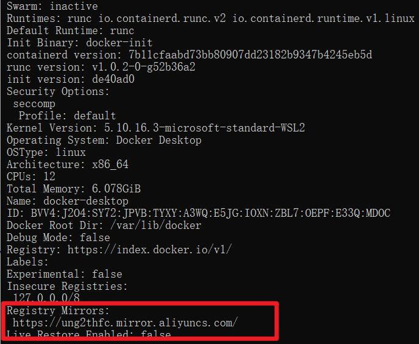

## 1.摘要

国内从DockerHub拉取镜像有时会遇到困难，此时可以配置镜像加速器。

Docker官方和国内很多云服务商都提供了国内加速器服务，建议根据运行docker的云平台选择对应的镜像加速服务。

下面列出国内常用的加速站点，排名不分先后,总体来说阿里云速度较稳定。

docker中国区官方镜像加速：

[https://registry.docker-cn.com](https://link.zhihu.com/?target=https%3A//registry.docker-cn.com/)

网易镜像加速：

[http://hub-mirror.c.163.com](https://link.zhihu.com/?target=http%3A//hub-mirror.c.163.com/)

中国科技大学镜像加速：

[https://docker.mirrors.ustc.edu.cn](https://link.zhihu.com/?target=https%3A//docker.mirrors.ustc.edu.cn/) 

腾讯云镜像加速： 

[https://mirror.ccs.tencentyun.com](https://link.zhihu.com/?target=https%3A//mirror.ccs.tencentyun.com/) 

阿里云镜像加速：

[https://ung2thfc.mirror.aliyuncs.com](https://link.zhihu.com/?target=https%3A//ung2thfc.mirror.aliyuncs.com/) 

## 2.Ubuntu中添加镜像加速

创建或修改/etc/docker/daemon.json文件
默认没有daemon文件，先创建。

```text
vim /etc/docker/daemon.json
```

添加如下内容：

{

  "registry-mirrors": [

“[https://ung2thfc.mirror.aliyuncs.com](https://link.zhihu.com/?target=https%3A//ung2thfc.mirror.aliyuncs.com) ”,

​    "[https://registry.docker-cn.com](https://link.zhihu.com/?target=https%3A//registry.docker-cn.com)",

​    "[http://hub-mirror.c.163.com](https://link.zhihu.com/?target=http%3A//hub-mirror.c.163.com)",

​    "[https://docker.mirrors.ustc.edu.cn](https://link.zhihu.com/?target=https%3A//docker.mirrors.ustc.edu.cn)"

  ]

}


## 3.加载重启docker

在终端输入以下命令

systemctl daemon-reload

systemctl restart docker

## 4.验证是否成功

打开终端执行docker info命令，可见下面信息。



拉取镜像，速度极快。

## 5.Win10中添加镜像加速

在registry-mirros参数上添加加速地址。


### 