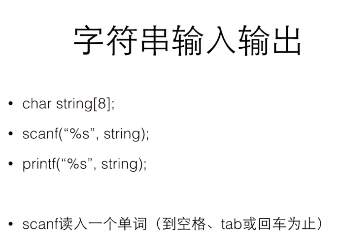
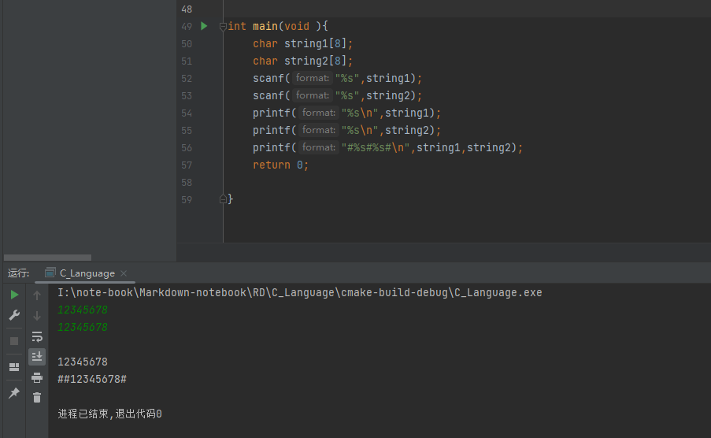
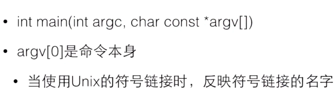
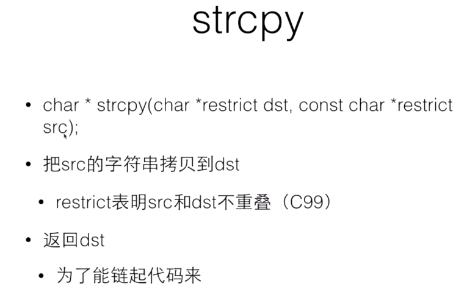
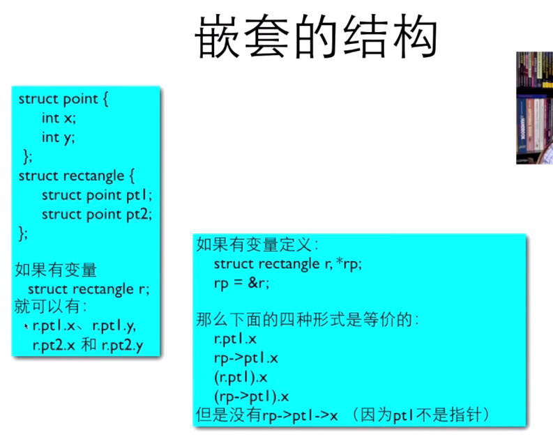

# C语言学习 翁恺教程
## 目录和文件说明
### note-1

- 1.c 
  - 嵌入式赋值
    - 不利于阅读
    - 容易出现错误
  - 猜数字游戏
    - 100以内的数字最多7次会被猜出来 2^7
    - rand() % 100 + 1 是1-100 的数字
  - 算最简分数
    - 基础算法
    - 欧几里得算法

### note-2

- [include/function.h](note-2/include/function.h  "title" ) [1.c](note-2/1.c);
  - 求素数
  - 数组与大小计算问题
  - 搜索数组问题

### note-3

- [1.c](note-3/1.c)
  - 数字计数器

### note-4

- [1.c](note-4/1.c) [1.h](note-4/1.h)
  - //swap
  - //min max
  - //指针应用2，函数返回运行状态，指针返回结果
  - 内存分配
  - 释放内存
  - 内存分配实验，最大,可以测试内存+虚拟内存最大
  - 申请了没有free->长时间运行内存逐渐下降
  - 新手： 忘了
  - 老手： 找不到合适的free时机
  - free过了再free是不行的
  - 地址变过了，直接去free

### note-5

```bash
 不能用运算符对字符串进行运算
 通过数组的方式可以遍历字符串
 唯一特殊的地方是字符串字面量可以用力啊初始化字符数组
 
 s是一个指针，初始化为指向一个字符串变量
 由于这个变量所在的地方，所以实际上s是const char * s ，但是由于历史原因，编译器接受不带const的写法
 但是试图对s所指的字符串做写入会导致严重后果
 
 两处相同的东西会指向同一个地方
 
 指针还是数组？
 数组： 这个字符串就在这里 作为本地变量空间自动回收
 指针： 这个字符串不知道在哪里 处理参数 动态分配空间
```


#### 字符串的输入和输出




字符串的不安全性



```bash
正确写法
printf("%7s",string1);
```


#### 安全的字符串输入


#### 常见错误


#### 空字符串


#### 细节

```c
**a 和 a[][]
```


[][]


#### 字符串的应用




```c
int main(int argc, char const *argv[]) {
    int i ;
    for ( i= 0; i< argc;i++){
        printf("%d:%s",i,argv[i]);
    }
    return 0;
}

I:\note-book\Markdown-notebook\RD\C_Language\cmake-build-debug\C_Language.exe
0:I:\note-book\Markdown-notebook\RD\C_Language\cmake-build-debug\C_Language.exe
进程已结束,退出代码0

  
PS I:\note-book\Markdown-notebook\RD\C_Language\cmake-build-debug> .\C_Language.exe 123
0:I:\note-book\Markdown-notebook\RD\C_Language\cmake-build-debug\C_Language.exe
1:123
```

#### 单字符输入输出putchar


```c
int main(int argc,char const *argv[]){
    int ch;
    while ((ch = getchar()) != EOF) {
        putchar(ch);
    }
    return 0;
}
```


#### 字符串处理函数strlen


```c
//strlen
#include "string.h"
int main(int argc,char *argv[]){
    char line[] = "Hello";
    printf("strlen=%u\n", strlen(line));
    printf("sizeof=%u\n", sizeof(line));
    return 0;
}


I:\note-book\Markdown-notebook\RD\C_Language\cmake-build-debug\C_Language.exe
strlen=5
sizeof=6

进程已结束,退出代码0
  
  

  
```


```c
//strcmp
int main(int argc,char * argv[]){
    char s1[ ] = "abc";
//    char s2[ ] = "abc";
    char s2[ ] = "Abc";
    // 因为地址永远不同，所以输出为0
    printf("%d\n",s1 == s2);
    printf("%d\n", strcmp(s1,s2));

    if (strcmp(s1,s2) == 0 ){

    }
    return 0;
}

I:\note-book\Markdown-notebook\RD\C_Language\cmake-build-debug\C_Language.exe
0
1

进程已结束,退出代码0

```

#### 字符串函数strcpy




```c
//初级版本
char *mycpy(char *dst, const char *src) {
    int idx = 0;
    while (src[idx] != '\0') {
        dst[idx] = src[idx];
        idx++;
    }
    dst[idx] = '\0';
    return dst;
}

int main(int argc, char *argv[]) {
    char s1[] = "abc";
    char s2[] = "abc";
    mycpy(s1,s2);
    return 0;
}
//高级版本
char *mycpy1(char *dst, const char *src) {
    char * ret = dst;
    while (*src) *dst++ = *src++;
    *dst = '0';
    return ret;
}

int main(int argc, char *argv[]) {
    char s1[] = "abc";
    char s2[] = "abc";
    mycpy(s1, s2);
    return 0;
}
```

复制字符串的过程


```bash
先申请内存+1，再cp
```

#### 字符串处理函数strcat


```c
\\strcpy和strcat，strcmp 是不安全的，如果目的地址没有内存空间
增加size_t n参数;
```


#### 字符串搜索函数


```c
int main(int argc, char *argv[]) {
    char s[] = "hello";
    char *p = strchr(s, 'l');
    char c = *p;
    *p = '\0';
    p = strchr(p + 1, 'l');
    printf("p=%s\n", p);
    // 将搜索的结果复制到另外的地方去
    char *t = (char *) malloc(strlen(p) + 1);
    strcpy(t, p);
    printf("t=%s\n", t);
    free(t);
    // 找到除了搜索外的其他的
    char *e = (char *) malloc(strlen(s) + 1);
    strcpy(e, s);
    printf("e=%s\n", e);
    free(e);
    *p = c;
    return 0;
}
```

#### 字符串中找字符串

```c
char * strstr(const char * s1,const char *s2);

char * strcasestr(const char * s1,const char *s2);
```

## 枚举

常量符号化

### 普通写法

```c
#include "stdio.h"


//const int red = 0;
//const int yellow = 1;
//const int green =2;

#define red 0
#define yellow 1
#define green 2


int main(int argc, char *argv[]) {
    int color = -1;
    char *colorName = NULL;

    printf("Input Color Code");
    scanf("%d", &color);
    switch (color) {

        case red :
            colorName = "red";
            break;
        case yellow:
            colorName = "yellow";
            break;
        case green:
            colorName = "green";
            break;
        default:
            colorName = "unKnown";
            break;
    }
    printf("Your favourite color is %s", colorName);
    return 0;
}
```

### 使用枚举来写

```c
enum COLOR {RED, YELLOW, GREEN};

int main(int argc, char *argv[]) {
    int color = -1;
    char *colorName = NULL;

    printf("Input Color Code");
    scanf("%d", &color);
    switch (color) {

        case RED :
            colorName = "red";
            break;
        case YELLOW:
            colorName = "yellow";
            break;
        case GREEN:
            colorName = "green";
            break;
        default:
            colorName = "unKnown";
            break;
    }
    printf("Your favourite color is %s", colorName);
    return 0;
}

```

### 枚举实例

```c
enum COLOR {
    RED, YELLOW, GREEN, NumCOLORS // NumCOLORS的表示数字就是在它之前有几个类型 计数枚举
};
//enum COLOR {
//    RED=1, YELLOW, GREEN, NumCOLORS=5 // 可以做离散定义，中间空缺
//};

void f(enum COLOR c);

int main(int argc, char *argv[]) {
    enum COLOR t;
    t = YELLOW;
//    scanf("%d", &t);
    f(t);
    return 0;
}

void f(enum COLOR c) {
    printf("%d\n", c);
}
```

## 数据结构

### 结构体和定义方式

```c
//结构体和定义方式
int main(int argc, char * argv[]){

    struct date {
        int month;
        int day;
        int year
    };
  
    // struct  {
    //     int x;
    //     int y;
    //     int z;
    // } p1, p2;
  
    // struct point {
    //     int x;
    //     int y;
    //     int z;
    // } p1, p2;
  
    struct date today;
  
    today.month = 05;
    today.day = 06;
    today.year = 2022;
    printf("Today's date is %i-%i-%i",today.month,today.day,today.year);
    return 0;
}
```

### 结构的初始化

```c
//结构的初始化
//结构变量无初始值为0
struct date {
    int month;
    int day;
    int year
};

int main(int argc, char *argv[]) {


//    struct date today;
//    today.month = 05;
//    today.day = 06;
//    today.year = 2022;
    struct date today = {05, 06, 2022};
    struct date thisMonth = {.month=5, .year=2022};

    printf("Today's date is %i-%i-%i\n", today.month, today.day, today.year);
    printf("Month's date is %i-%i-%i\n", thisMonth.month, thisMonth.day, thisMonth.year);
    return 0;
}


I:\note-book\Markdown-notebook\RD\C_Language\cmake-build-debug-mingw\C_Language.exe
Today's date is 5-6-2022
Month's date is 5-0-2022

进程已结束,退出代码0
```

### 结构运算

- 要访问整个结构，直接用结构变量名字
- 对于整个结构，可以做赋值、取地址，也可以传递给函数参数
  - p1 = (struct point ) {5, 10}; //相当于 p1.x = 5; p1.y = 10;
  - p1 = p2; //相当于p1.x = p2.x; p1.y = p2.y;
  - ✨数组不能这样运算

```c
int main(int argc, char *argv[]) {


//    struct date today;
//    today.month = 05;
//    today.day = 06;
//    today.year = 2022;
    struct date today = {05, 06, 2022};
//    struct date thisMonth = {.month=5, .year=2022};
    struct date thisMonth;
    thisMonth = today;

    printf("Today's date is %i-%i-%i\n", today.month, today.day, today.year);
    printf("Month's date is %i-%i-%i\n", thisMonth.month, thisMonth.day, thisMonth.year);
    return 0;
}


I:\note-book\Markdown-notebook\RD\C_Language\cmake-build-debug-mingw\C_Language.exe
Today's date is 5-6-2022
Month's date is 5-6-2022

进程已结束,退出代码0

```

### 结构指针

- 和数组不同，结构变量的名字并不是结构变量的地址，必须使用&运算符
- struct date * pDate = &today;

```c
struct date {
    int month;
    int day;
    int year
};

int main(int argc, char *argv[]) {


//    struct date today;
//    today.month = 05;
//    today.day = 06;
//    today.year = 2022;
    struct date today = {05, 06, 2022};
    struct date * pDate = &today;

    printf("Today's date is %i-%i-%i\n", today.month, today.day, today.year);
    printf("Day's date is %i-%i-%i\n", pDate->month, pDate->day, pDate->year);
    return 0;
}
```

### 结构作为函数参数

`int numberOfDays(struct date d)`

- 整个结构可以作为参数的值传入函数
- 这时候是在函数内新建一个结构变量，并复制调用者的结构的值

```c
struct date {
    int month;
    int day;
    int year;
};

bool isLeap(struct date d);

int numberOfDays(struct date d);

int main(int argc, char *argv[]) {
    struct date today, tomorrow;

    printf("Enter today's date [mm dd yyyy]:");
    scanf("%i %i %i", &today.month, &today.day, &today.year);
    if (today.day != numberOfDays(today)) {
        tomorrow.day = today.day + 1;
        tomorrow.month = today.month;
        tomorrow.year = today.year;
    } else if (today.month == 12) {
        tomorrow.day = 1;
        tomorrow.month = 1;
        tomorrow.year = today.month + 1;

    } else {
        tomorrow.day = 1;
        tomorrow.month = today.month + 1;
        tomorrow.year = today.year;
    }
    printf("Tomorrow date is %i-%i-%i\n", tomorrow.month, tomorrow.day, tomorrow.year);
    return 0;
}

int numberOfDays(struct date d) {
    int days;
    const int daysPerMonth[12] = {31, 28, 31, 30, 31, 30,
                                  31, 31, 30, 31, 30, 31};
    if (d.month == 2 && isLeap(d)) days = 29;
    else days = daysPerMonth[d.month - 1];
    return days;
}

bool isLeap(struct date d) {
    bool leaps = false;
    if ((d.year % 4 == 0 && d.year % 100 != 0) || d.year % 400 == 0) {
        return true;
    } else {
        return false;
    }
}


I:\note-book\Markdown-notebook\RD\C_Language\cmake-build-debug-mingw\C_Language.exe
Enter today's date [mm dd yyyy]:05 06 2022
Tomorrow date is 5-7-2022

进程已结束,退出代码0

```

### 输入结构

- 没有直接的方式可以一次scanf一个结构
- 如果我们打算写一个函数读入结构
  - `->`

```c
struct point {
    int x;
    int y;
};


void getStruct(struct point p);

void output(struct point p);

int main(int argc, char *argv[]) {
    struct point y = { 0, 0 };
    printf("%d %d\n",y.x,y.y);
    getStruct(y);
    printf("%d %d\n",y.x,y.y);
    output(y);
    return 0;
}

void output(struct point p) {
    printf("%d %d\n",p.x,p.y);
}

void getStruct(struct point p) {
    scanf("%d",&p.x);
    scanf("%d",&p.y);
    printf("%d %d\n",p.x,p.y);
}


I:\note-book\Markdown-notebook\RD\C_Language\cmake-build-debug-mingw\C_Language.exe
0 0
1 2  //输入
1 2
0 0
0 0

进程已结束,退出代码0
```


```c
// 初等解决方案
struct point {
    int x;
    int y;
};

struct point getStruct(void);

void output(struct point p);


int main(int argc, char *argv[]) {
    struct point y = { 0, 0 };
    printf("%d %d\n",y.x,y.y);
    y = getStruct();  //
    printf("%d %d\n",y.x,y.y);
    output(y);
    return 0;
}

void output(struct point p) {
    printf("%d %d\n",p.x,p.y);
}

struct point getStruct(void ){//
    struct point p ;
    scanf("%d",&p.x);
    scanf("%d",&p.y);
    return p;
}

// 高级解决方案

如下 👇
```

### 指向结构的指针

```bash
// 用->表示指针所指的结构变量中的成员
struct date {
    int month;
    int day;
    int year;
} myDay;

int main(int argc,char * argv[]){
    struct date * p = &myDay;
    (*p).month = 12;
    printf("%d",p->month);
    return 0;
}


struct point {
    int x;
    int y;
};


struct point *getStruct(struct point *pPoint);  // 常用套路

void output(const struct point point1);

int main(void) {
    struct point y = {0, 0};
//    getStruct(&y);
//    printf("%d-%d\n", y.x, y.y);
//    output(y);

    output(*getStruct(&y));
    return 0;
}

void output(const struct point point1) {
    printf("%d-%d\n", point1.x,point1.y);

}

struct point *getStruct(struct point *pPoint) {
    printf("%d-%d\n", pPoint->x, pPoint->y);
    scanf("%d", &pPoint->x);
    scanf("%d", &pPoint->y);
    printf("%d-%d\n", pPoint->x, pPoint->y);
    return pPoint;
}

I:\note-book\Markdown-notebook\RD\C_Language\cmake-build-debug-mingw\C_Language.exe
0-0
1 2 //
1-2
1-2
1-2
1-2
2 4 //
2-4
2-4

进程已结束,退出代码0

```


## 结构中的结构

### 结构数组

> struct date dates [100];
>
> struct date dates[] = {
>
> ​    {4,5,2005},
>
> ​    {2,4,2005}
>
> };
>

```c
struct time {
    int hour;
    int minutes;
    int seconds;
};


struct time timeUpdate(struct time now);

int main(void) {
    struct time testTimes[5] = {
            {11, 59, 59},
            {12, 0,  0},
            {1,  29, 59},
            {23, 59, 59},
            {19, 12, 27}
    };
    int i;
    for (i = 0; i < 5; ++i) {
        printf("Time is %.2d-%.2d-%.2d\n",
               testTimes[i].hour, testTimes[i].minutes, testTimes[i].seconds);

        testTimes[i] = timeUpdate(testTimes[i]);
        printf("... One second later is %.2d-%.2d-%.2d\n",
               testTimes[i].hour, testTimes[i].minutes, testTimes[i].seconds);
    }
    return 0;
}

struct time timeUpdate(struct time now) {
//    struct time result;
    if (now.seconds == 59 && now.minutes != 59) {
        now.minutes += 1;
        now.seconds = 0;
    } else if (now.seconds == 59 && now.minutes == 59) {
        now.hour += 1;
        now.minutes = 0;
        now.seconds = 0;
    } else {
        now.seconds += 1;
    }
    return now;
}


I:\note-book\Markdown-notebook\RD\C_Language\cmake-build-debug-mingw\C_Language.exe
Time is 11-59-59
... One second later is 12-00-00
Time is 12-00-00
... One second later is 12-00-01
Time is 01-29-59
... One second later is 01-30-00
Time is 23-59-59
... One second later is 24-00-00
Time is 19-12-27
... One second later is 19-12-28

进程已结束,退出代码0
```

### 结构中的结构

> struct dateAndTime {
>
> ​    struct daste sdate;
>
> ​     struct time stime;
>
> };




## 自定义数据类型（typedef）

> 例如： `typedef int Length`
>
> - 使得Length成为int类型的别名
>
> - 这样Length这个名字就可以代替int出现在变量定义和参数声明的地方了
>
>   ```c
>   Length a,b,len;
>   Length number[10];
>   ```
>
>   


```c


struct time {
    int hour;
    int minutes;
    int seconds;
};

struct date {
    int day;
    int month;
    int year;
};

struct point {
    int x;
    int y;
};

typedef struct dataAndTime {
    struct date sdata;
    struct time stime;
} dataAndTime;

typedef struct rectangle {
    struct point pt1;
    struct point pt2;
} rectangle;

typedef struct node {
    int data;
    struct node *next;

} aNode;

int main(void) {


    return 0;
}

```


## 联合union

> ```c
> union AnElt {
>     int i;
>     char c;
>     
> } elt1, elt2;
> 
> int main(void ){
>     elt1.i = 4;
>     elt2.c = 'a';
>     elt2.i = 0xDEADBEEF;
>     printf("123");
>     return 0;
> }
> ```
>
> 选择：
>
> 成员是 
>
> - 一个int i 
> - 还是一个char c
>
> sizeof(union ...) = sizeof(每个成员)的最大值

> - 存储
>   - 所有成员共享一个空间
>   - 同一时间只有一个成员是有效的
>   - ubion的大小是其对打的成员
> - 初始化
>   - 对第一个成员做初始化

Example

```c


```

