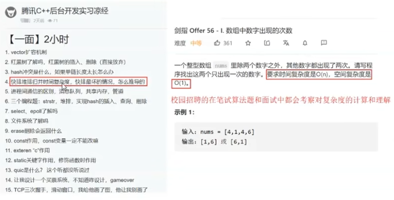

# Lesson2: 算法的时间复杂度和空间复杂度

**实现目标**

> 算法效率
>
> 时间复杂度
>
> 空间复杂度
>
> 常见时间复杂度以及复杂度的练习

## 1. 算法效率

### 1.1 如何衡量一个算法的好坏

如何衡量一个算法的好坏呢？比如对于一下斐波那契数列：

```c
 long long Fib(int N):
{
	if(N < 3){
		//TODO
		return 1;
	}
	return Fib(N-1) + Fib(N-2)
}
```

斐波那契数列非常简洁，但简洁一定就好吗？那该如何衡量其好与坏的呢？

### 1.2 算法的复杂度

算法在编写成可执行程序后，运行时需要耗费时间资源和空间（内存）资源。因此 **衡量一个算法的好坏，一般是从空间和时间两个维度来衡量的**，即时间复杂度和空间复杂度。

**时间复杂度主要衡量一个算法的运行快慢，而空间复杂度主要衡量一个算法运行所需要的额外空间**。在计算机发展的早期，计算机的存储容量很小。所以对空间复杂度很是在乎。但是经过计算机行业的迅速发展，计算机的容量已经达到了很高的程度。所以我们如今已经不需要再特别关注一个算法的空间复杂度。

### 1.3 复杂度在校招中的考察




## 2.时间复杂度

### 2.1时间复杂度的概念

时间复杂度的定义： 在计算机科学中，**算法的时间复杂度是一个函数**，它定量描述了该算法的运行时间。一个算法执行所耗费的时间。从理论上说，是不能算出来的，只有你把你的程序放在机器上跑起来，才能知道。但是我们需要每个算法都上级测试吗？是可以都上机测试，但是这很麻烦，所以才有了时间复杂度这个分析方式。一个算法所花费的时间与其中语句的执行次数成正比例，**算法的基本操作的执行次数，为算法的时间复杂度**

即： 找到某条基本语与问题规模N之间的数学表达式，就是算出了该算法的时间复杂度。


```bash
// 请算一下Func1中++count语句总共执行了多少次

#include<stdio.h>
 
 
void Func1(int N){
	int count =0;
	for(int i=0;i<=N;++i){
		for(int j=0;j<=N;++j){
			++count;
		}
	}
	
	for(int k=0;k <2;++k){
		++count;
	}
	
	int M=10;
	while(M--){
		++count;
	}
	printf("%d\n", count);
}

```


Func1执行的基本操作次数：F(N) = N² + 2*N + 10

N = 10 F(N) = 130
N = 100 F(N) = 10210
N = 1000 F(N) = 1002010

实际上我们计算时间复杂度的时候，其实并不一定要计算精确的执行次数，而只需要大概执行次数，那么这里我们使用大O的渐进表示法。

    大O符号（Big O notation）:是用于描述函数渐进行为的数学符号。

推导大O阶方法(重点！！！)：

    1.用常数1取代运行时间中的所有加法常数。
    2.在修改后的运行次数函数中，只保留最高阶项。
    3.如果最高阶项存在且不是1，则去除与这个项目相乘的常数。得到的结果就是大O阶。

使用大O渐进表示法以后，根据规则第二点只保留最高项，Func1的时间复杂度为：O（N²）

N = 10 F(N) = 100
N = 100 F(N) = 10000
N = 1000 F(N) = 1000000

通过上面我们会发现大O的渐进表示法去掉了那些对结果影响不大的项，简洁明了的表示出了执行次数。

### 另外有些算法的时间复杂度存在最好、平均、和最坏情况（重点！！！）：

最坏情况：任意输入规模的最大运行次数（上界）
平均情况：任意输入规模的期望运行次数
最好情况：任意输入规模的最小运行次数（下界）

例如：在一个长度为N的数组中搜索一个数据x

最好的情况：1次找到
最坏的情况：N次找到
平均情况：N/2次找到

    在实际情况中时间复杂度的估算实际上是一种悲观的估算，关注的是算法的最坏运行情况，所以数组中搜索数据的时间复杂度复杂度为O（N）。
## 3.常见时间复杂度计算举例

### 实例1：

    // 计算Func2的时间复杂度？
    void Func2(int N)
    {
    	int count = 0;
    	for (int k = 0; k < 2 * N; ++k)
    	{
    		++count;
    	}
    	int M = 10;
    	while (M--)
    	{
    		++count;
    	}
    	printf("%d\n", count);
    }

本段代码基本执行操作是2N+10次，根据推导大O阶方法，只保留最高阶并且去除与这个项目相乘的常数，时间复杂度为O（N）

### 实例2：

    // 计算Func3的时间复杂度？
    void Func3(int N, int M)
    {
    	int count = 0;
    	for (int k = 0; k < M; ++k)
    	{
    		++count;
    	}
    	for (int k = 0; k < N; ++k)
    	{
    		++count;
    	}
    	printf("%d\n", count);
    }

本段代码基本执行操作是M + N次，因为M和N是两个未知数，所以时间复杂度为O（M + N）.
这里多提一点，如果告诉M远大于N，那么此时的时间复杂度就为O(M)，因为时间复杂度就是一个估算的过程。

### 实例3

    // 计算Func4的时间复杂度？
    void Func4(int N)
    {
    	int count = 0;
    	for (int k = 0; k < 100; ++k)
    	{
    		++count;
    	}
    	printf("%d\n", count);
    }

本段代码基本执行次数为100次，100是一个常数，根据推导大O阶方法，用常数1取代常数，时间复杂度为O(1)。

### 实例4：

    // 计算strchr的时间复杂度？
    const char * strchr(const char * str, int character);

这里简单介绍一下strchr函数，这个函数是在一个字符串中查找一个字符。
这样的话基本执行操作次数最好的情况是1次直接找到，最坏的情况是N次遍历完整个字符串才找到，而时间复杂度关注的是最坏的情况，故时间复杂度为O(N)。

### 实例5：

    // 计算斐波那契递归Fibonacci的时间复杂度？
    long long Fibonacci(size_t N)
    {
    	return N < 2 ? N : Fibonacci(N - 1) + Fibonacci(N - 2);
    }

这道题如果仅仅看函数的话是分析不出来的，这里需要画图来分析。
在这里插入图片描述
总共的调用次数应该是1+21+22+···+2(n-2)+2(n-1)-空掉部分 = 2n - 1 - 空掉部分。因为有的地方会提前算到1而结束，所以必须减掉一部分。
根据推导大O阶方法，最终的时间复杂度应该是O（2^n）。

介绍这道题的主要目的是想告诉大家，在求解时间复杂度的时候千万不要仅仅抱着代码在那啃。要知道很多复杂程序的时间复杂度光用眼睛看代码是看不出来的，毕竟人脑是有限的，所以需要自己动手画图，这样才能看清楚程序到底运行了多少次数，因此大家一定要养成勤动手画图的好习惯。


时间复杂度的求解就介绍到这里，下面我们再一起来看空间复杂度的求解。

## 空间复杂度

### 1.空间复杂度的概念

    空间复杂度是对一个算法在运行过程中临时占用存储空间大小的量度。空间复杂度不是程序占用了多少字节的空间，因为这个也没太大意义，所以空间复杂度算的是变量的个数。空间复杂度计算的规则基本跟时间复杂度类似，也使用大O渐进表示法。

### 2.常见空间复杂度计算举例

#### 实例1：


    // 计算BubbleSort的空间复杂度？
    void BubbleSort(int* a, int n)
    {
    	assert(a);
    	for (size_t end = n; end > 0; --end)
    	{
    		int exchange = 0;
    		for (size_t i = 1; i < end; ++i)
    		{
    			if (a[i - 1] > a[i])
    			{
    				Swap(&a[i - 1], &a[i]);
    				exchange = 1;
    			}
    		}
    		if (exchange == 0)
    			break;
    	}
    }

这是一段实现冒泡排序的代码，代码共开辟了5个变量为常数，根据大O渐进法，空间复杂度为O（1）。
所以大家在做题的时候，如果题目要求空间复杂度是O（1），你可千万不要理解为只能创建一个变量，O（1）的含义是所创建的变量个数必须为常数。

#### 实例2：

    // 计算Fibonacci的空间复杂度？
    long long* Fibonacci(size_t n)
    {
    	if (n == 0)
    		return NULL;
    
    	long long * fibArray = (long long *)malloc((n + 1) * sizeof(long long));
    	fibArray[0] = 0;
    	fibArray[1] = 1; 
    
       for (int i = 2; i <= n; ++i)
    	{
    		fibArray[i] = fibArray[i - 1] + fibArray[i - 2];
    	}
    	return fibArray;
    }

这段代码实现的功能是将前n个斐波那契数存放在一个动态开辟的数组中。
动态内存开辟了N个变量，空间复杂度为O（N）。

空间复杂度的例子就介绍这两个，实际上现在除了在嵌入式开发这类特殊情况下，其他开发的过程中最看重还是对时间复杂度的要求，因为现在内存的发展程度已经很高了，人们在开发的时候往往会牺牲空间而换取时间效率。不过两种复杂度求解的方法我们都应该熟练的掌握，千万不能偷懒啊。

最后希望这篇文章可以为大家带来帮助。
